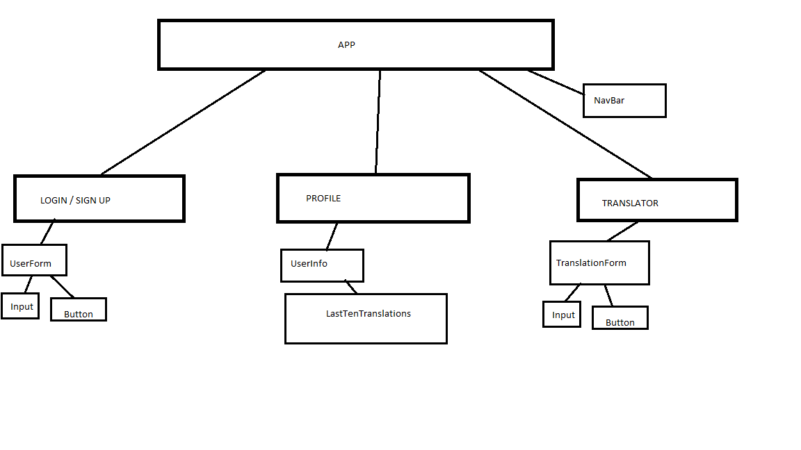

# Lost In Translation app
This app was made by using React.js

Lost In Translation app changes user's input to sign language.

App was Front-end Development_Assignment 2 in Noroff's .NET Front End Course.

## Login

Login fetch data from API and checks if user exist. If user doesn't exist, app will create new user in API and storage userdata in local storage. Before log in, user cannot access different pages.

## Profile

Profile page shows users 10 latest translations and has option to clear history. Also log out button can be found from there.

## Translate

In translate user input is turned to sign language and user input is stored in API. User cannot input numbers or special characters. 

## Original component tree

## Technologies

Project was completed by using React.js and API.

